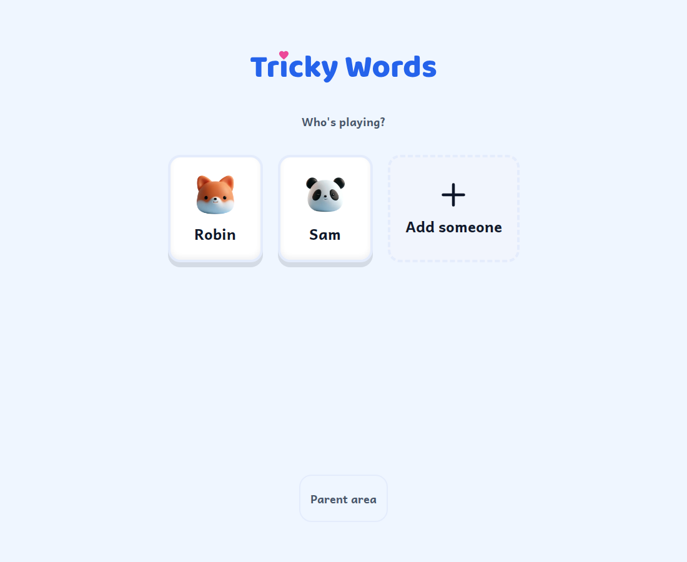
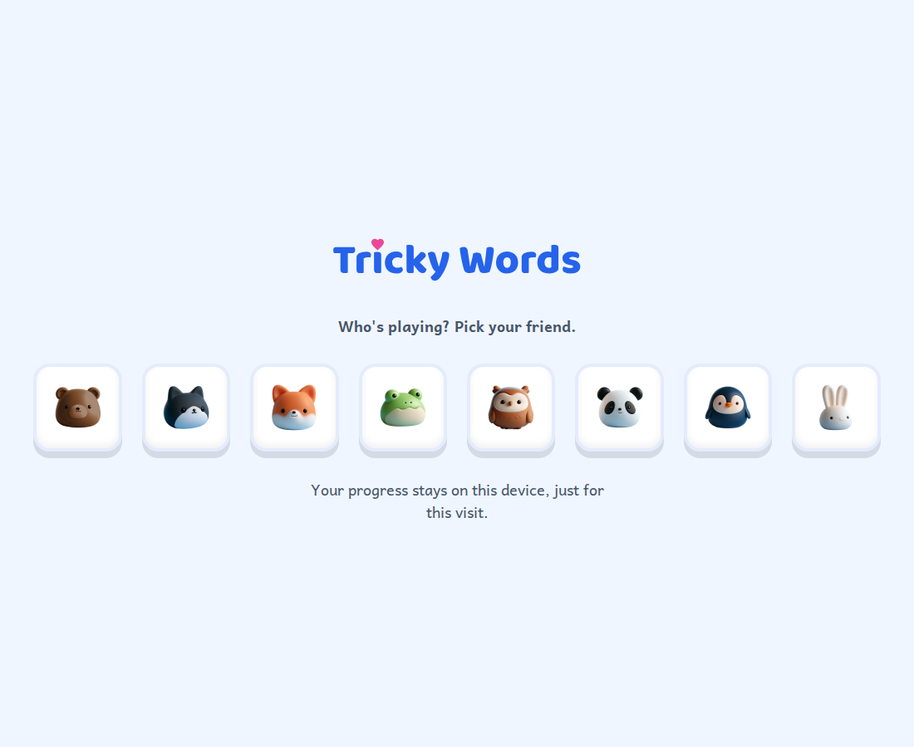
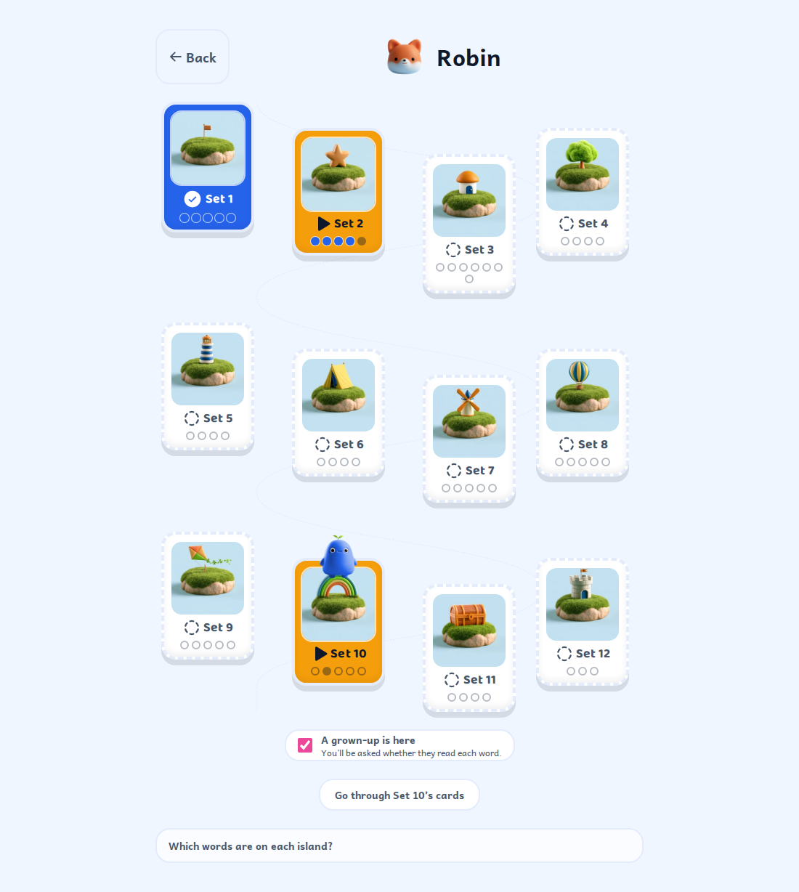
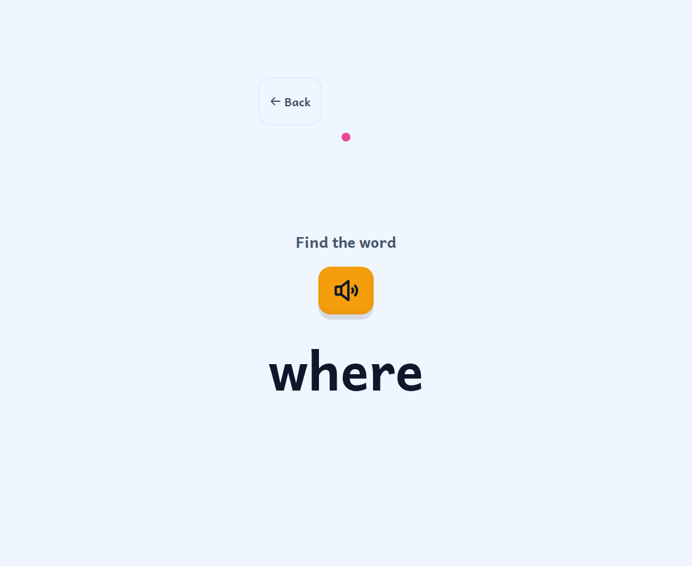
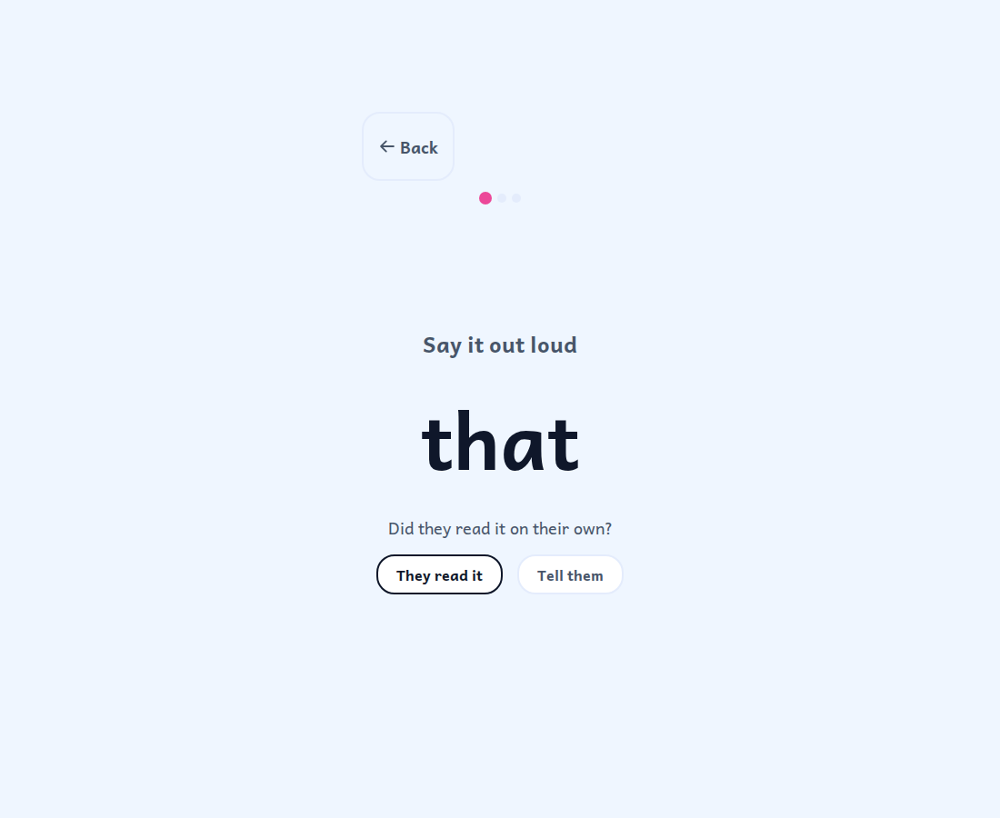
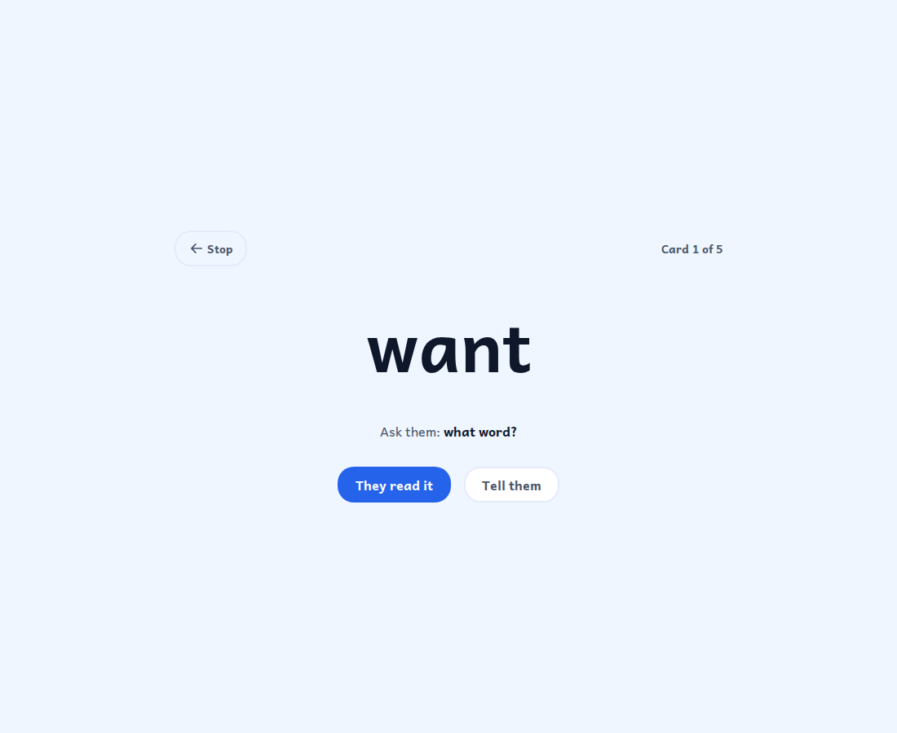
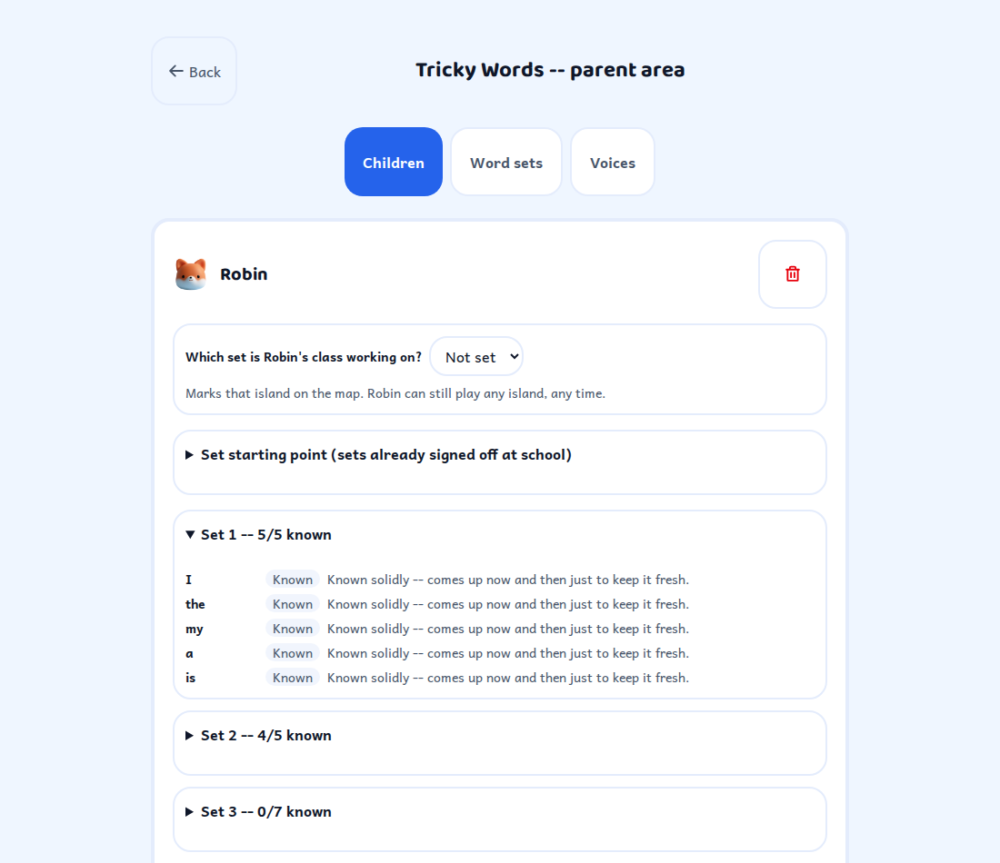
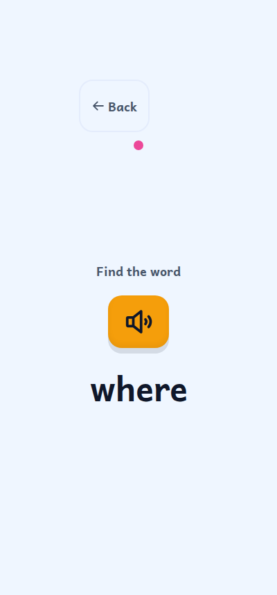

<h1 align="center">Tricky Words</h1>

> Teaches five-to-seven-year-olds their tricky words through short, playful, self-hosted games — with no fail states and nothing collected it doesn't need.

<p align="center"></p>

<p align="center">
  <a href="https://github.com/the-kizz/trickywords/releases/latest"></a>
  <a href="https://github.com/the-kizz/trickywords/actions/workflows/ci.yml"></a>
  <a href="LICENSE"></a>
  
  
</p>

## What it is

Tricky Words is a self-hosted web app for helping a young child learn
high-frequency "tricky" words — the ones that show up constantly in early
reading but don't always sound out the way they're spelled (*said*,
*was*, *they*). It runs as **one Docker container** on a home server,
holds no cloud dependencies, and phones nothing home.

It exists because most sight-word apps for this age either gamify failure
(timers, lives, red crosses) or reduce reading to picture-matching. This
one is built around how children actually learn to read words — by
mapping sounds to letters, not by memorising shapes — and around how
five- and six-year-olds actually use touchscreens: big targets, no
dragging, audio for every instruction, and a response to every tap.

One container serves **two surfaces**:

- **The family surface**, on port 3000, always on. Named child profiles,
  real per-word progress remembered across sittings, the parent area.
  **LAN or VPN only** — this is the side that holds your children's data.
- **The guest surface**, on port 3001, off until you switch it on with a
  single environment variable. It asks no name, stores nothing on the
  server, and serves one screen: pick a friendly avatar and play. This is
  the side you can put on a subdomain for a classroom, a cousin, a
  friend.

Same container, same games, two very different data footprints. The
switch is `TRICKYWORDS_PUBLIC` — unset, port 3001 isn't even bound.

<p align="center"></p>

## Guiding principles

1. **No fail states.** Nothing in the child-facing app ever says "wrong."
   A mistake gets a gentle re-prompt and another go — never a loss, a red
   cross, or a score ticking down.
2. **Errorless first, fading support.** A word's earliest encounters are
   engineered so the child can barely get it wrong. Support — distractor
   count, prompting, hints — fades as the word gets stronger.
3. **Teach the word, not the picture of the word.** Built on orthographic
   mapping (sounds bonded to letters), not visual memorisation of whole
   shapes.
4. **Honest about difficulty.** A word that's actually decodable is
   presented as decodable, not as something to memorise by rote.
5. **Collect nothing we don't need.** The guest surface collects nothing
   at all. The family surface holds only what a parent typed in
   themselves.

## What's in the box

- **Three kinds of round, each genuinely different** — *Find it* (hear
  the word, pick its written form), *Read it* (the word alone with no
  sound, read out loud) and *Build the Word* (place a heart word's letter
  chunks in order). Nothing between the child and playing: tapping an
  island starts the session, the session picks the rounds, and a correct
  Find it on a word that is coming along opens a chest and then shows and
  reads the word's own sentence with the word lit.
  <br>*Read it* is the only round that runs the other way — from the
  written form to the sound — which is what the school actually assesses,
  and it runs only when a grown-up is there to hear it. On their own, the
  child is asked to read one word at the end of a sitting and to judge it
  themselves; that is recorded and never counted as evidence, because
  nothing in this app listens and a five-year-old's own verdict on their
  reading is not a measurement.
  <br>There used to be seven games. Five of them were the same act —
  hear the word, tap it among a few others — wearing a different noun,
  and one of them could be won without reading anything. What each was
  actually right about is kept as a moment inside a correct round.
- **A progress engine** — an expanding-interval spaced-retrieval
  scheduler (a "ladder") that decides which words are due, how much
  support each one still needs, and when a word has moved from *learning*
  to *known*.
- **A companion and an island map** — the visible layer over that
  progress: twelve islands to explore, and a companion that grows
  alongside the child and sits on the island they are on. One reward, and
  it only ever grows: it is drawn from the most words they have ever known
  at once, so nothing they have earned is taken away. Nothing here is a
  score — there's no tally to read, win, or lose.
- **A parent area** — PIN-gated: add or remove a child, see real
  per-word progress (including a plain-language note when a word "keeps
  slipping", and whether anybody has actually heard the word read aloud),
  set a child's starting point, edit word sets, and optionally record your
  own voice for any word.
- **A grown-up switch, and a card run** — one toggle per child for "a
  grown-up is here", which turns on *Read it* rounds and makes your
  verdict count on the same ladder as a tap. It lasts for the day only, so
  it is never left on by accident. Beside it, *cards*: the island's words
  dealt one at a time with no game around them, which is the school's own
  whole-word routine and the closest thing here to the test a teacher
  gives.
- **A switchable guest surface** — the same rounds and the same
  twelve bundled word sets, served with no name, no cookies, and no
  parent area, for anyone to use without creating an account or leaving
  a trace.

<p align="center">
  
  
</p>
<p align="center">
  
  
</p>
<p align="center">
  
  
</p>

## The research behind it

The design choices above aren't arbitrary — each one is a direct
consequence of a specific finding, documented in full in
[`docs/superpowers/specs/2026-09-16-trickywords-design.md`](docs/superpowers/specs/2026-09-16-trickywords-design.md):

- **Orthographic mapping, not flashcards** (Ehri, 2014; Kilpatrick,
  2015) — words are stored in memory by bonding phonemes to graphemes,
  not as visual shapes. Every word record carries a phoneme/grapheme
  segmentation, and Heart Word Builder teaches that mapping directly.
- **Spaced retrieval, expanding schedule** — repeated *retrieval*
  outperforms repeated *exposure*, and expanding intervals keep early
  recall likely to succeed while still stretching memory over time. The
  scheduler is driven by recall attempts, not time-on-screen.
- **Errorless learning** — prompting that makes a correct response
  near-certain, then fading that prompt as a word strengthens, reduces
  frustration and raises motivation during acquisition.
- **Child physical and cognitive development (Nielsen Norman Group)** —
  children aged 5–7 need touch targets around 2cm × 2cm (roughly 4× the
  adult minimum) and struggle badly with dragging. Every interactive
  element here is at least 76px, nothing anywhere requires a drag, and
  every instruction has an audio version.

## Stack

Next.js 16 (App Router) · React 19 · TypeScript · Tailwind CSS 4 ·
Motion · SQLite via Drizzle ORM · self-hosted Andika + Baloo 2 fonts ·
Piper-generated audio · original CC0 avatars · Phosphor icons.

## Install

### Family only

One container, one volume, one port:

```bash
docker run -d \
  --name trickywords \
  -p 3000:3000 \
  -v trickywords_data:/app/data \
  ghcr.io/the-kizz/trickywords:latest
```

Then open `http://<your-server>:3000`, tap **Parent area**, and add your
first child.

Keep port 3000 on your **LAN or behind a VPN**. It serves your
children's names, their per-word progress, and any voice recordings you
make for them. Don't put it on the internet.

### Family plus the guest side

Add the variable and publish the second port. Nothing else changes —
same image, same container, same database:

```bash
docker run -d \
  --name trickywords \
  -p 3000:3000 \
  -p 3001:3001 \
  -e TRICKYWORDS_PUBLIC=1 \
  -v trickywords_data:/app/data \
  ghcr.io/the-kizz/trickywords:latest
```

Now port 3000 is the family surface as before, and port 3001 serves the
guest surface. Put your reverse proxy (Caddy, Nginx Proxy Manager,
Cloudflare Tunnel, …) in front of **3001 only** — no path rewriting
needed. The subdomain root goes straight to the game, so
`https://words.example.com/` is the whole link you share, and
`https://words.example.com/?set=3` shares one particular set.

`TRICKYWORDS_PUBLIC` accepts `1`, `true` or `yes`. Anything else — a
typo included — leaves port 3001 unbound, so the guest side can never be
switched on by accident.

### How the two surfaces are kept apart

Inside the container the app itself listens on loopback only
(`127.0.0.1:3100`) and is never published. Both ports are served by a
small supervisor in front of it:

- **Port 3000** passes everything straight through.
- **Port 3001 is deny-by-default.** Only `/play`, `/api/health` and the
  static assets a guest needs (`/_next/static/*`, `/_next/image*`,
  `/audio/*`, `/fonts/*`, `/avatars/*`, `/favicon.ico`, `/og-card.png`) are routed at
  all. Everything else — `/parent`, `/api/parent*`, `/api/progress`,
  `/api/profiles`, `/play/<child>`, and any route added in future — gets
  a 404 from the listener and never reaches the app. Paths are matched on
  the parsed, normalised pathname, so traversal and percent-encoding
  tricks don't get a second look.
- **`/` is answered by the listener, not forwarded.** The root (and
  `/index.html`) gets a 302 to `/play`, query string intact. It is
  deliberately *not* an allowlist entry: because the app never sees a
  request for `/` on this port, the family profile chooser cannot be
  rendered there even if the guard below were broken.
- **A second, independent layer.** The guest listener stamps a surface
  header on everything it forwards, and the app refuses the entire family
  surface for any request carrying it — including the two routes that
  render a child's *name*, `/` and `/play/<child>`. Two layers over every
  one of them, so one bug in one layer isn't enough. Both listeners strip
  any inbound copy of that header first, so it is never client input —
  and even if it were, the only thing it can do is restrict a caller,
  never widen access.

Read [`SECURITY.md`](SECURITY.md) before you expose port 3001 — it also
states plainly what this design does **not** protect against.

### Image tags

| Tag | What it is |
|---|---|
| `:latest` | Latest stable release. What you want. |
| `:edge` | Latest commit on `main` — unreleased, may break. |
| `:1` | Latest `1.x.y` release. |
| `:1.0` | Latest `1.0.y` release. |
| `:1.0.0` | That exact release, pinned. |

### Compose

```yaml
services:
  trickywords:
    image: ghcr.io/the-kizz/trickywords:latest
    container_name: trickywords
    restart: unless-stopped
    environment:
      TZ: Etc/UTC
      # Uncomment to switch the guest side on.
      # TRICKYWORDS_PUBLIC: "1"
    ports:
      - "3000:3000"   # family surface — LAN or VPN only
      - "3001:3001"   # guest surface — unbound unless switched on
    volumes:
      - trickywords_data:/app/data

volumes:
  trickywords_data:
```

See [`docker/docker-compose.yml`](docker/docker-compose.yml) for the full
file, with a healthcheck included. The data volume is the only writable
mount the container needs; don't add another.

## Environment variables

| Variable | Default | Meaning |
|---|---|---|
| `TRICKYWORDS_PUBLIC` | unset | Switches the guest surface on. `1`, `true` or `yes`; anything else leaves port 3001 unbound. |
| `TRICKYWORDS_DB` | `/app/data/trickywords.db` | Path to the SQLite database. |
| `TRICKYWORDS_DATA_DIR` | `/app/data` | Where edited word sets and voice recordings are written. |
| `TZ` | container default | Timezone, for correctly-dated progress records. |
| `TRICKYWORDS_MODE` | `family` | Advanced: set to `public` to make the container public-*only* — the family surface is switched off on both ports and no database is touched. Fails closed to `family` on anything else, so a typo here can never silently turn into a public deployment. |
| `PORT` / `TRICKYWORDS_FAMILY_PORT` | `3000` | Port the family surface listens on inside the container. |
| `TRICKYWORDS_PUBLIC_PORT` | `3001` | Port the guest surface listens on inside the container. |
| `TRICKYWORDS_APP_PORT` | `3100` | Loopback port the app itself binds. Never published; change it only if it clashes inside the container. |
| `TRICKYWORDS_PUBLIC_PROTO` | `http` | Scheme the two listeners stamp on `x-forwarded-proto` for requests they forward. Set to `https` when a TLS-terminating reverse proxy (Caddy, Nginx Proxy Manager, Cloudflare Tunnel, …) sits in front, so the app builds `https://` links instead of silently downgrading to `http://`. Only `http` or `https` (case-insensitive, whitespace trimmed) are accepted; anything else falls back to `http`. |
| `TRICKYWORDS_SITE_URL` | unset | Optional. Your public base URL (e.g. `https://words.example.org`), used only so link-preview scrapers (WhatsApp, iMessage, Slack) get an absolute Open Graph image URL. Entirely optional — the app works with no internet and no domain either way; an unset or invalid value just omits it and serves a relative image URL instead. |

## Word sets

Tricky Words ships with twelve default word sets — they happen to be the
tricky words our own daughter's school sends home, in the order they're
taught. They're a genuinely useful default for an Australian classroom
sequence, but they're just a starting point: every set is **fully
editable** from the parent area, word by word or set by set, so you can
match whatever list your own school or curriculum uses. This project has
**no affiliation with, and no endorsement from, any reading program,
publisher or school.**

Each word in a set is tagged as one of three kinds, and the app is
deliberately honest about which is which rather than treating every word
as something to memorise:

- **heart words** — mostly regular, with one irregular part flagged to
  be learned by heart (*said*, *the*, *they*)
- **decodable words** — fully regular; the child is expected to sound
  these out, not memorise them (*that*, *look*, *with*)
- **family words** — regular members of a shared spelling pattern, taught
  together (*all*, *call*, *ball*, *tall*)

Edits apply to the family surface. The guest surface always serves the
twelve bundled defaults, so switching it on never publishes a word list
you've customised.

## Development

```bash
npm install
npm run dev        # http://localhost:3000
npm test           # unit tests (Vitest)
npm run test:e2e   # end-to-end tests (Playwright)
npm run typecheck
```

The E2E suite starts the real container entrypoint
(`docker/entrypoint.mjs`) with the guest side switched on, then runs the
family tests against the family port and the isolation tests against the
guest port of that **same** server. The privacy claims above are only
worth making if they're proven against the listener that actually ships,
rather than against a second server started a different way.

## Known limits

- Single-child-language: English sight words only, no i18n yet.
- Voice recording (parent-read audio) is stored unencrypted on disk,
  same as everything else on the family side — see [Security](#security).
- No multi-device sync for family profiles; progress lives in the one
  SQLite file on the one host.
- No accessibility audit beyond the built-in touch-target and
  audio-instruction requirements — screen reader support is functional,
  not exhaustively tested.
- One container means one filesystem: the family database sits alongside
  the process that serves guest traffic. [`SECURITY.md`](SECURITY.md)
  spells out what that does and doesn't mean.
- Restarts cover a *dead* app, not a *hung* one. If the app process
  exits, the container exits non-zero and your restart policy replaces
  it. If it wedges while still alive, the ports answer with 502s and the
  healthcheck goes `unhealthy` — but Docker does not restart on
  `unhealthy` by itself, so that needs an external watcher (Autoheal, a
  systemd timer, your orchestrator's liveness handling).

## Contributing

See [`CONTRIBUTING.md`](CONTRIBUTING.md). Small project, PRs welcome,
please open an issue before a big change.

## License

[AGPL-3.0](LICENSE).

## Security

Run the family surface on your home network or behind a VPN. Do not
expose port 3000 to the internet.

The parent PIN is a **child gate, not authentication**. It stops a
six-year-old wandering into the settings and deleting their sibling's
profile, and nothing more: it isn't rate-limited and it isn't a
substitute for keeping the family surface off the public internet.

The guest surface (port 3001) is the supported way to put Tricky Words
on a public address. It serves an allowlist of paths and nothing else,
asks no name, sets no cookies, and makes no database writes.

See [`SECURITY.md`](SECURITY.md) for the full threat model, the two
layers of the boundary, the residual risk of running both surfaces from
one container, and how to report a vulnerability.

## Credits

Audio generated offline with [Piper](https://github.com/OHF-Voice/piper1-gpl).
Artwork commissioned for this project. Icons from
[Phosphor Icons](https://phosphoricons.com) (MIT).
Fonts: Andika and Baloo 2, both SIL Open Font License 1.1. Full
attribution in [`NOTICE`](NOTICE).

<sub>Built with the help of Claude (Anthropic).</sub>
